# 🐳 AWS Operations Dashboard — Containerized Microservices

A containerized AWS operations dashboard that gives any team member visibility into cloud billing, resource inventory, and CloudWatch alarms. No AWS login required, no console knowledge, and no IAM credentials needed. Three Flask microservices run on ECS Fargate and pull live data directly from AWS APIs, all served through a single CloudFront frontend at dashboard.kevinlutes.com.

I built this because I wanted to go beyond single-service deployments and work with a true microservices architecture. Three independent containers run behind a single load balancer, each responsible for its own data source and its own set of AWS permissions. Security was a major focus throughout the project. ECS tasks run in private subnets with no public IPs, the ALB is protected by a secret CloudFront origin header, and each container uses its own least-privilege IAM role.

---

## 🏗️ Architecture

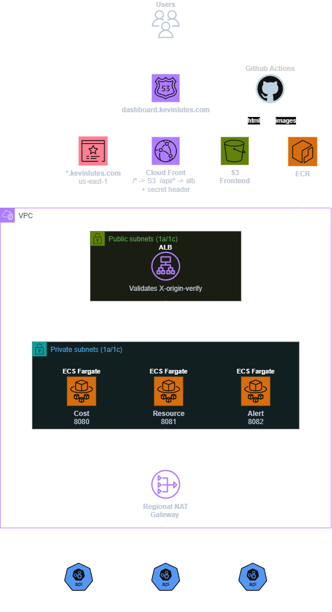

### Security design

ECS Fargate tasks run in **private subnets** with no public IPs. All outbound traffic — including AWS API calls from the containers — routes through a **NAT Gateway**. The ALB sits in public subnets but is protected by a **secret custom origin header** (`X-Origin-Verify`) validated on every HTTPS listener rule. CloudFront injects this header automatically on every request it forwards to the ALB. The ALB's default action returns 403 for anything missing it, making direct ALB access impossible even if the DNS name is known.

This defense-in-depth approach combines network-level isolation (private subnets) with application-level access control (header validation). AWS CloudFront VPC Origins — released late 2024 — would allow a fully internal ALB with no public surface at all, eliminating the need for the header pattern entirely. This project uses the header approach as it's the established standard and explicitly demonstrates the underlying mechanism.

### Why ALB over API Gateway

API Gateway would add rate limiting and usage plans but introduces per-request cost and an additional network hop. For an internal dashboard, ALB with path-based routing is simpler, lower latency, and the right tool. The CloudFront secret header pattern handles access control equivalently to API Gateway's API keys for this use case.

---

## 🛠️ AWS Services Used

| Service | Purpose |
|---|---|
| **ECS Fargate** | Serverless container orchestration — 3 microservices, no EC2 to manage |
| **ECR** | Private container registry for all three service images |
| **ALB** | Path-based routing to three target groups (`/api/cost/*`, `/api/resources/*`, `/api/alerts/*`) |
| **CloudFront** | CDN with two origins — S3 for frontend, ALB for API — unified under one domain |
| **S3** | Static frontend hosting |
| **Route 53** | DNS routing `dashboard.kevinlutes.com` to CloudFront |
| **ACM** | Wildcard TLS certificate in `us-east-1` for CloudFront, `us-west-1` for ALB |
| **VPC** | Private and public subnets across 2 AZs with security group chaining |
| **NAT Gateway** | Outbound access from private subnets to AWS APIs |
| **IAM** | Per-service task roles with least-privilege inline policies |
| **Cost Explorer** | Billing data pulled by the cost microservice |
| **CloudWatch** | Alarm status pulled by the alert microservice |
| **SNS** | Notification publishing from the alert microservice |
| **Terraform** | Full infrastructure as code |
| **GitHub Actions** | OIDC-authenticated CI/CD for images and frontend |

---

## 🔑 Key Design Decisions

**Three independent microservices instead of one monolith**

Each service has a single responsibility, its own Docker image, its own ECR repo, its own ECS task definition, its own target group, and its own IAM role. Cost service only has `ce:GetCostAndUsage`. Resource service only has `ec2:DescribeInstances`, `rds:DescribeDBInstances`, and `s3:ListAllMyBuckets`. Alert service only has `cloudwatch:DescribeAlarms` and `sns:Publish`. No shared roles, no overpermissioned policies — each container can only do exactly what it needs to do.

**CloudFront as the single entry point**

The frontend and API live under one domain (`dashboard.kevinlutes.com`) with no separate `api.` subdomain. CloudFront routes `/*` to S3 and `/api/*` to the ALB based on path-based cache behaviors. This eliminates CORS entirely — the browser makes relative path requests (`/api/cost/summary`) and CloudFront handles the routing transparently. The frontend has no knowledge of where the backend lives.

**Secret origin header locking down the ALB**

The ALB has a public DNS name because it needs to be reachable from CloudFront. Without the header check, anyone who discovers that DNS name could bypass CloudFront entirely and hit the backend directly. CloudFront injects `X-Origin-Verify: <secret>` on every request to the ALB origin. The HTTPS listener rules require both the correct path pattern and the header — no header means 403 before the request ever reaches ECS. The secret lives only in `terraform.tfvars` (gitignored) and the CloudFront origin config, never in the frontend or any client-accessible location.

**Terraform manages everything, pipelines handle the rest**

All 40+ AWS resources are defined in Terraform with remote state in S3. Terraform doesn't touch Docker images — that's the CI/CD pipeline's job. `deploy-images.yml` builds and pushes all three images to ECR and forces new ECS deployments on any change to `services/**`. `deploy-frontend.yml` uploads the HTML to S3 and auto-invalidates CloudFront on any change to `frontend/**`. Both use OIDC authentication — no stored AWS credentials anywhere.

---

## 📁 Project Structure

```
aws-container-microservices-project/
├── .github/
│   └── workflows/
│       ├── deploy-images.yml
│       └── deploy-frontend.yml
├── frontend/
│   └── index.html
├── infra/
│   ├── main.tf
│   ├── variables.tf
│   ├── outputs.tf
│   └── backend.tf
├── services/
│   ├── cost-service/
│   │   ├── app.py
│   │   └── Dockerfile
│   ├── resource-service/
│   │   ├── app.py
│   │   └── Dockerfile
│   └── alert-service/
│       ├── app.py
│       └── Dockerfile
└── .gitignore
```

---

## ✅ Validation

### Dashboard — Cost Tab
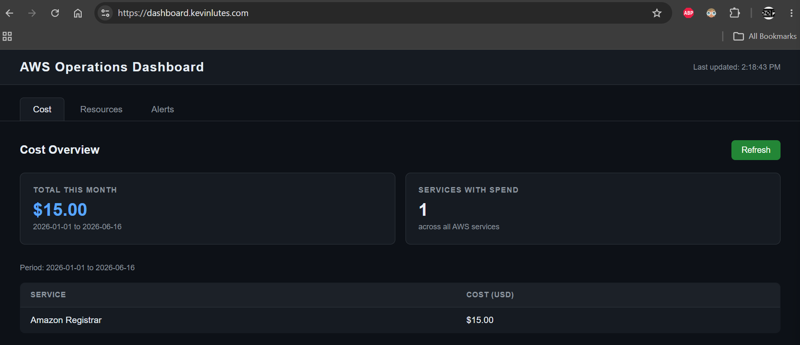

### Dashboard — Resources Tab
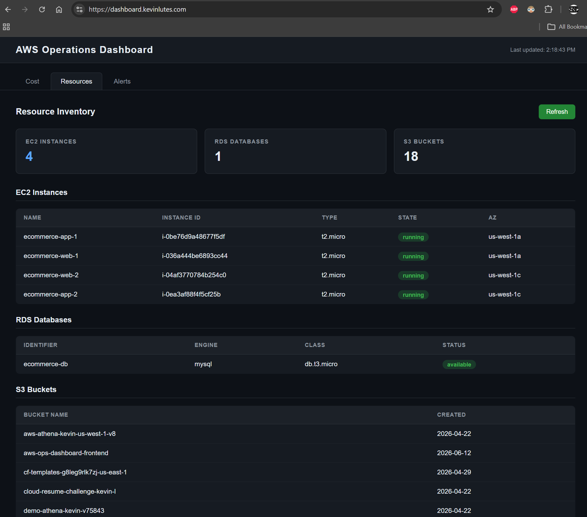

### Dashboard — Alerts Tab
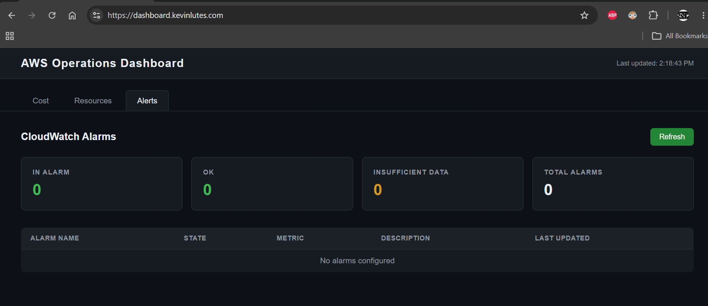

### HTTPS


---

## ⚙️ CI/CD Pipelines

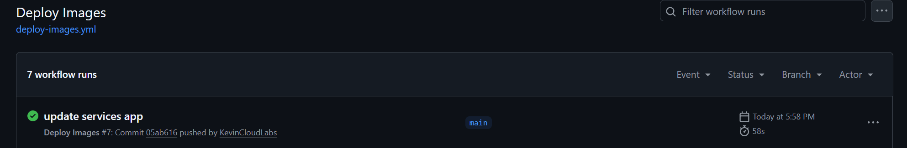
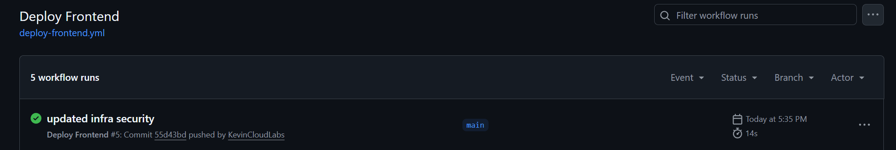

Two GitHub Actions workflows using OIDC — no stored AWS credentials.

**`deploy-images.yml`** triggers on pushes to `services/**`. Builds all three Docker images, pushes to ECR, and force-deploys all three ECS services.

**`deploy-frontend.yml`** triggers on pushes to `frontend/**`. Uploads `index.html` to S3 and automatically invalidates the CloudFront cache by looking up the distribution ID from the alias record — no hardcoded distribution IDs.

Terraform runs locally. The pipelines own application and frontend deployment only.

---

## 🌍 Infrastructure

### ECS — Services Running in Private Subnets
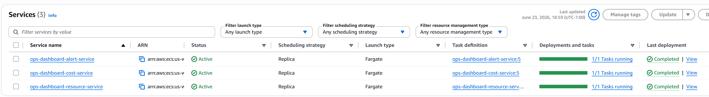

### ALB — HTTPS Listener Rules with Header Condition
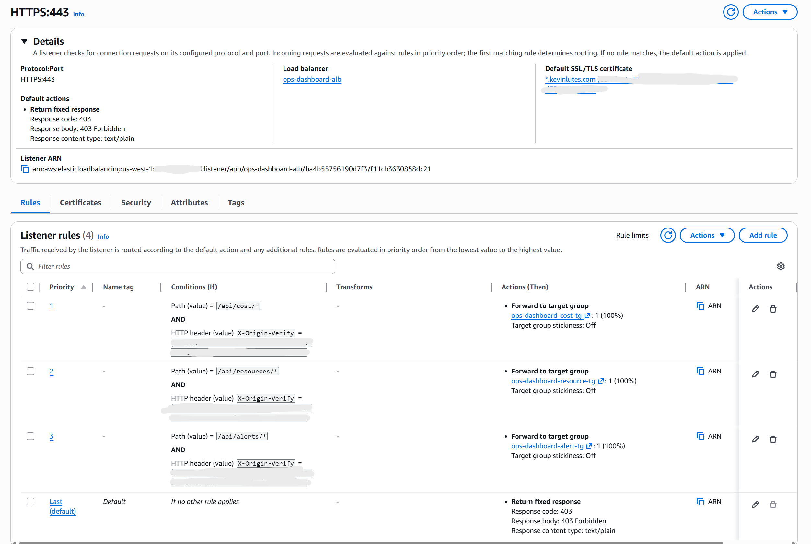

### CloudFront — Two Origins (S3 + ALB)
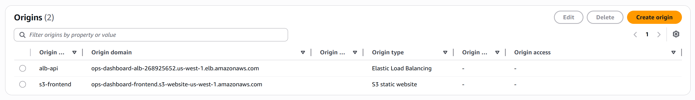

### VPC & Networking
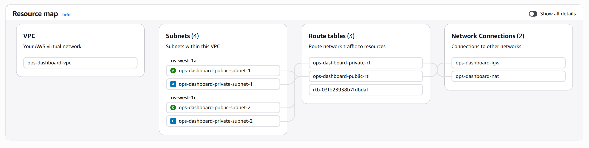
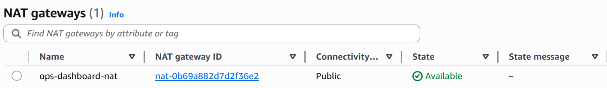

### ECR
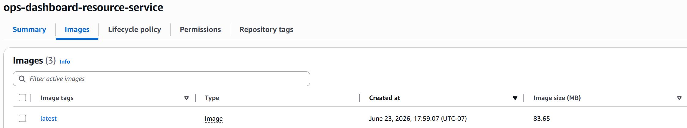

### ECS Detail
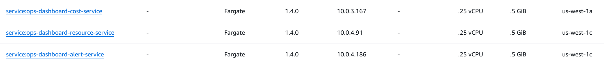
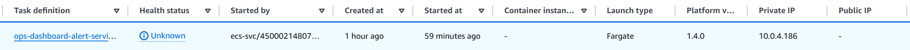

### ALB
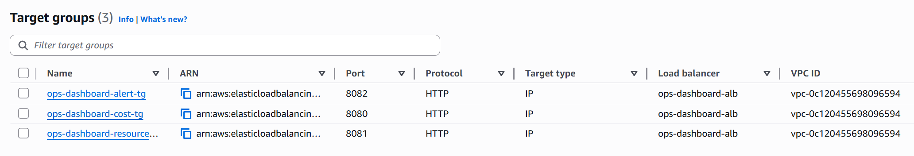

### Security Groups


### CloudFront & Route 53
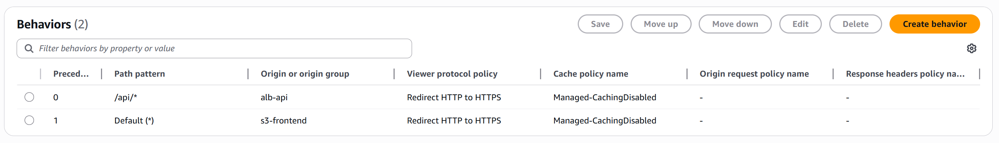


---

## 📚 What I Learned

- How to design and deploy three independent microservices behind a single ALB with path-based routing
- ECS Fargate — task definitions, services, target group registration, private subnet networking, and ECR image pulling
- The CloudFront multi-origin pattern: one distribution with two origins and path-based cache behaviors, eliminating CORS
- The `X-Origin-Verify` secret header pattern for ALB protection — how it works, why it's needed, and where it sits in the request lifecycle
- Per-service IAM task roles with least-privilege inline policies — the difference between execution role and task role
- How CloudFront and ALB certificates require different AWS regions (`us-east-1` vs regional)
- Building OIDC-authenticated GitHub Actions pipelines with automatic CloudFront cache invalidation

---

## 🧩 Challenges

**CloudFront serving cached old frontend after updates**

After updating `index.html` in S3, CloudFront continued serving the old version. The fix was a CloudFront invalidation after every S3 upload — now automated in `deploy-frontend.yml` by querying the distribution ID from the alias rather than hardcoding it.

**ECS tasks in private subnets couldn't pull ECR images**

Moving ECS to private subnets meant tasks no longer had direct internet access to pull Docker images from ECR. The NAT Gateway solves this — outbound requests from private subnets route through the NAT to reach ECR's public endpoints.

**ALB returning 502 due to HTTPS redirect on the HTTP listener**

The original HTTP listener (port 80) was configured to redirect to HTTPS. CloudFront connects to the ALB over HTTP, so every API request was getting redirected to the raw ALB HTTPS URL — which the browser rejected due to a certificate mismatch. The fix was changing the HTTP listener default action to a fixed-response 403, with forwarding rules that check the `X-Origin-Verify` header — so CloudFront's HTTP requests are accepted and forwarded to ECS rather than redirected away.

**Browser cache masking frontend changes**

Chrome was serving a cached version of the dashboard even after CloudFront propagated the new HTML. Hard refresh and incognito mode confirmed the update was live — the issue was purely local browser caching.

---

## 🤖 A Note on AI Assistance

The Flask microservice code, Dockerfiles, frontend dashboard, and CI/CD pipeline YAML were developed with AI assistance. All AWS architecture, infrastructure, IAM design, networking, and Terraform were designed and built by me.

---
